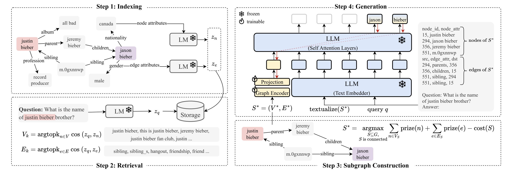

# Main Architecture

## Step 1: Indexing

We need the following components:

 - Frozen Language models to encode all nodes and edges: SentenceBERT
 - Data preprocessor module for each dataset ( to make a graph in CSV format )

## Step 2: Retrieval
 - kNN Algorithm
    - SceneGraph: k = 3, $C_e$ = 1
    - WebQSP: k = 3 for nodes, k = 5 for edges, $C_e = 0.5$
    - ExplaGraphs: k = 0 (Retrieve whole graphs, since they are small)

## Step 3: Subgraph Construction
 - Performing PCST (Prize-Collecting Steiner Tree)

## Step 4: Generation
 - LLM (including Text Embedder, and it seems like using BPE + torch's nn.Embedding module): Llama2-7b
 - Projection Module: MLP, What about its architecture?
 - Graph Encoder: Graph Transformer

## Miscellaneous Things
 - Optimizer: AdamW (Adaptive one)

## Remaining Questions
 - How to train?
    - Fine-tuning with LoRA
    - Training projection and graph encoder (i.e., soft prompting-related matrices)
    - Measures? (hit@1?)
    - Each graph exists for each question?

Note: In this implementation, we provide only G-Retriever with LoRA fine-tuning. (Other options such as LLM only, G-Retriever without GNN are just taking out each component)